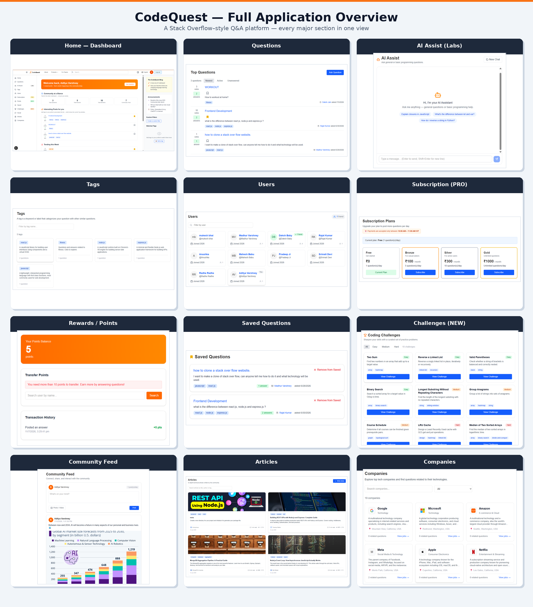

# Social Q&A & Knowledge Sharing Platform

# CodeQuest

A modern Full-Stack Social Q&A Platform inspired by Stack Overflow, designed to combine knowledge sharing with social networking. Users can ask questions, share posts, build professional connections, earn rewards through community participation, and manage their accounts securely with advanced authentication and multilingual support.


## 🚀 Features

### 👤 Authentication & Security
- User Registration & Login
- Email OTP Verification
- Forgot Password via Email
- Forgot Password via Mobile Number
- Random Password Generator
- Login History Tracking
- Browser & Device Detection
- Secure Authentication Rules
- OTP-based Language Switching
- Session Validation & Access Control

### 💬 Community & Social Features
- Public Question & Answer Platform
- Public Social Feed
- Create, Edit & Delete Posts
- User Profiles
- Friend System
- Like, Comment & Share Posts
- Image Uploads
- Video Uploads
- Community Interaction

Posting Rules
- 0 Friends → Cannot create public posts
- 1 Friend → 1 post/day
- 2 Friends → 2 posts/day
- Similarly with 3-10 Friends
- More than 10 Friends → Unlimited posts/day

### ❓ Question & Answer System
- Ask Questions
- Submit Answers
- Subscription-based Question Limits
- Community Voting
- Reward Points for Answers
- Bonus Rewards for Popular Answers
- Automatic Point Deduction for Deleted or Downvoted Answers

### 🏆 Reward System
- Earn 5 Points per Answer
- Bonus 5 Points after Receiving 5 Upvotes
- User Reputation Display
- Reward Point Transfers
- Secure Backend Validation
- Real-time Point Updates

### 💳 Subscription & Payments
- Free Plan
- Bronze Plan
- Silver Plan
- Gold Plan
- Razorpay / Stripe Dummy Integration
- Invoice Email Generation
- Subscription Confirmation Emails
- Subscription-based Posting Limits
- Payment Time Validation

### 🌍 Multi-language Support

Supported Languages:

- English
- Hindi
- Spanish
- Portuguese
- Chinese
- French

Additional Security:

- Email OTP required for all Languages

### 📱 Smart Login Rules

Desktop

- Google Chrome → Email OTP Required
- Microsoft Edge → Direct Login

Mobile

- Login Allowed Only Between 12:00 AM – 12:00 PM (IST)

### 📊 User Dashboard
- View Profile
- View Reward Points
- Login History
- Subscription Details
- Friend Management
- Language Preferences

---

## 🚀 Tech Stack

### Frontend
- Next.js
- React
- TypeScript
- CSS

### Backend
- Node.js
- Express.js

### Database
- MongoDB

---

## 📂 Project Structure

```
.
├── server/
└── stack/
```

---

## CodeQuest Overview


---

### ✨ Highlights
- Secure Authentication System
- Knowledge Sharing Platform
- Social Networking Features
- Reward-based Community Engagement
- Subscription Management
- Payment Integration
- Login History & Device Tracking
- Multi-language Support
- OTP Protected Sensitive Operations
- Responsive User Interface
- RESTful Backend Architecture

---

#### Future Enhancements
- Real-time Notifications
- Chat System
- AI-powered Answer Suggestions
- Dark Mode
- Rich Text Editor
- Admin Dashboard
- Content Moderation
- Bookmark Questions
- Trending Topics
- Progressive Web App (PWA)

---

## 👨‍💻 Author

Aditya Varshney

If you found this project useful, consider giving it a ⭐ on GitHub.